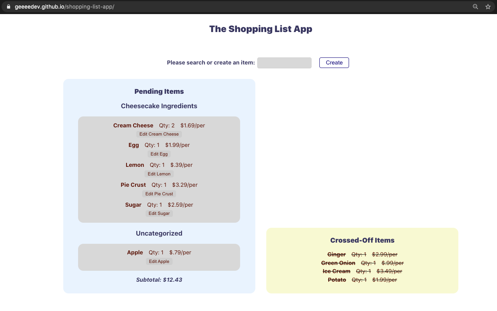

## This is a Shopping List app built in React with Styled Component
[Live Demo](https://geeeedev.github.io/shopping-list-app/)

Technology used:

- React.js
- Styled Component
- GitHub Pages deployment

Features Included:

- Fuzzy Search/Filter
- Click to cross off/toggle items
- Modifiable categories and items
- Grouped categories
- Tallied subtotal

Future Improvements:

1. Clean up alignment
1. Improve update entry
1. Add drag and drop

> Additional codes commented out are intentionally left in for my learning purposes

